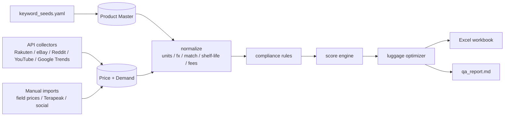

# Japan → DMV Arbitrage Analytics

**Product Opportunity Intelligence Pipeline** for validating small-batch resale of Japanese
products (souvenirs, snacks, cosmetics, character goods) in the DMV (DC / Maryland / Virginia)
area — using ~1.5 suitcases of luggage space.

This is **not** a scraper. It is an **API-first, semi-automated, human-verified** analytics
pipeline that ranks candidate SKUs by *net profit density*, *demand heat*, *sell-through*,
*shelf-life*, *compliance risk*, and *packing feasibility*, then solves a constrained
suitcase-packing problem and exports a decision-ready Excel workbook.

> ⚠️ This project is business/technical tooling, **not** legal, tax, customs, or FDA advice.
> Compliance / platform-sellability is enforced as a **hard filter**, not an afterthought.
> Always verify import declaration, food/cosmetic/drug classification, labeling, sales tax,
> and platform policy with a human before buying or selling.

---

## Quick start

```bash
# 1. (optional) create a virtual env, then install
pip install -e ".[dev]"

# 2. copy env template and fill in whatever API keys you have (all optional)
cp .env.example .env

# 3. run the whole pipeline end-to-end on the bundled sample data
python -m app.cli init-db
python -m app.cli import-seeds --file config/keyword_seeds.yaml
python -m app.cli manual-import --type field_prices  --file data/manual_imports/japan_store_prices.csv --run-id 2026-07-japan-trip
python -m app.cli manual-import --type terapeak       --file data/manual_imports/terapeak.csv         --run-id 2026-07-japan-trip
python -m app.cli manual-import --type social_notes   --file data/manual_imports/xhs_notes.csv         --run-id 2026-07-japan-trip
python -m app.cli normalize   --run-id 2026-07-japan-trip
python -m app.cli score       --run-id 2026-07-japan-trip
python -m app.cli export-xlsx --run-id 2026-07-japan-trip --out data/exports/japan_dmv_product_rankings.xlsx
python -m app.cli qa-report   --run-id 2026-07-japan-trip --out data/exports/qa_report.md
```

A one-shot convenience command runs every step above:

```bash
python -m app.cli run-all --run-id 2026-07-japan-trip
```

On Windows PowerShell use `Copy-Item .env.example .env` instead of `cp`.

---

## Pipeline



## CLI commands

| Command | Purpose |
| --- | --- |
| `init-db` | Create the SQLite analytics database from `app/storage/schema.sql`. |
| `import-seeds` | Load candidate SKUs / aliases from a seeds YAML into Product Master. |
| `collect` | Run API collectors (Rakuten, eBay Browse, Reddit, YouTube, Google Trends). |
| `manual-import` | Import human-exported CSVs (`field_prices`, `terapeak`, `social_notes`, `google_trends`). |
| `normalize` | Currency + unit conversion, pack-size parsing, product matching, shelf-life, fees. |
| `score` | Compliance rules → weighted score → penalties → priority tier → luggage plan. |
| `export-xlsx` | Write the decision workbook with all tabs + conditional formatting. |
| `qa-report` | Write a Markdown QA report for the run. |
| `run-all` | Convenience: run every step above in order. |

## Data confidence

Every key field carries a confidence level so you can trust the ranking:
`api_verified` › `manual_verified` › `scraped_low_confidence` › `missing`.

## What this project deliberately does NOT do

- No CAPTCHA bypass, proxy rotation, fingerprint spoofing, or ban-evasion.
- No scraping of private groups or personal profiles / PII.
- No high-frequency requests — collectors are rate-limited, cached, and logged.
- Login/CAPTCHA pages are handled with a *headed* browser + manual capture, never bypassed.

See [docs/manual_review_sop.md](docs/manual_review_sop.md) and
[docs/data_dictionary.md](docs/data_dictionary.md) for details.
