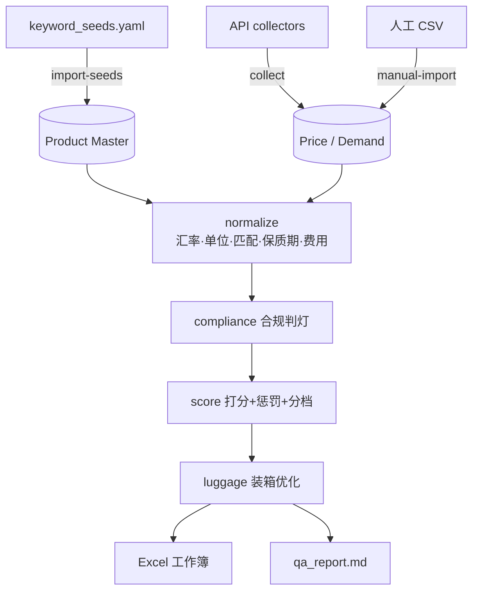

# 项目工作原理：苏格拉底式讲解

> 这份文档不是"说明书"，而是一场**对话**。
> 每一节我都会先抛一个问题（❓），请你先停下来想几秒，再往下看"一起推导"（💡）。
> 这样你记住的不是"代码在哪"，而是"**为什么要这样设计**"。
>
> 配套源码链接都可以点开对照阅读。建议一边读一边翻 [app/](../app) 目录。

---

## 第 0 章 · 先建立直觉：我们到底在解决什么问题？

❓ **问题 0.1**：你有 **1.5 个行李箱** 的空间，要从日本带商品回 DMV（华盛顿特区周边）转卖。
你打开购物网站，第一反应会用什么标准挑东西？

*（先想想……）*

💡 大多数人的第一直觉是：**"哪个差价大买哪个"**。日本买 10 块、美国卖 30 块，赚 20，冲！

❓ **问题 0.2**：那么请比较这两个商品：
- A：一支口红，日本 $4、美国卖 $15，**只占一个手掌大**；
- B：一盒饼干礼盒，日本 $10、美国卖 $30，**占半个行李箱**。

哪个"更值得带"？

💡 如果只看差价，B（赚 $20）> A（赚 $11）。
但行李箱空间是**稀缺资源**。A 占的体积可能只有 B 的 1/20。
所以真正该比的是 **"每升利润" (profit per liter)**，而不是裸差价。

> 🔑 **第一个核心概念：利润密度。**
> 我们后面会算 `profit_per_liter = 净利润 / 体积(升)`。

❓ **问题 0.3**：现在有个"神商品"——日本防晒霜，利润超高、社媒超火。买爆？

💡 **不行。** 防晒霜（SPF）在美国被 FDA 当作 **OTC 药品** 监管；日本眼药水也是药；冷藏生巧克力夏天会化、还涉及冷链/食品安全。
这些东西无论多赚钱，都**不该进这次的采购清单**。

> 🔑 **第二个核心概念：合规是"硬门槛"（hard filter），不是备注。**
> 违规的商品直接被枪毙（`RED → Blocked`），根本不参与排名。

❓ **问题 0.4**：所以这个项目到底是什么？一个"爬价格的爬虫"吗？

💡 不是。它是一个 **"选品情报流水线" (Product Opportunity Intelligence Pipeline)**：

$$
\text{最终决策} = f(\underbrace{\text{利润密度}}_{\text{价格侧}},\ \underbrace{\text{需求热度}}_{\text{需求侧}},\ \underbrace{\text{合规风险}}_{\text{风险侧}},\ \underbrace{\text{行李箱约束}}_{\text{执行侧}})
$$

带着这个直觉，我们开始拆解它是怎么一步步实现的。

---

## 第 1 章 · 数据从哪里来？（collectors）

❓ **问题 1.1**：要判断"某个 SKU 值不值得带"，你至少需要收集哪几类数据？

💡 一起列一下：

| 类别 | 具体数据 | 回答什么问题 |
| --- | --- | --- |
| 采购价（JP） | 日本店里/网上多少钱 | 成本是多少？ |
| 售价（US） | 美国实际成交价 | 能卖多少钱？ |
| 需求热度 | 小红书/TikTok/Reddit/eBay 成交量 | 有人想要吗？好卖吗？ |
| 合规 | 是不是药/食品/危险品 | 能合法卖吗？ |
| 物理属性 | 体积、重量、保质期 | 装得下吗？会坏吗？ |

❓ **问题 1.2**：这些数据都能"自动爬"吗？比如小红书、Facebook Marketplace？

💡 **不能，也不该。** 这些平台反爬强、要登录、涉及隐私和 ToS 风险。
所以项目定了一条纪律（见 [app/collectors/\_\_init\_\_.py](../app/collectors/__init__.py)）：

> **API 优先 → 官方 API 拿不到就人工导出 CSV → 再拿不到就用"有头浏览器 + 人工操作 + 存快照"，绝不绕验证码。**

这就解释了为什么 [collectors/](../app/collectors) 里有三类文件：

| 类型 | 代表文件 | 做什么 | 没有 API key 会怎样？ |
| --- | --- | --- | --- |
| **API 采集器** | [ebay_browse.py](../app/collectors/ebay_browse.py)、[rakuten_ichiba.py](../app/collectors/rakuten_ichiba.py)、[yahoo_jp_shopping.py](../app/collectors/yahoo_jp_shopping.py)、[reddit.py](../app/collectors/reddit.py)、[youtube.py](../app/collectors/youtube.py) | 调官方 API，限速+缓存 | **优雅跳过**并记日志，不报错 |
| **人工 CSV 导入** | [manual_price_import.py](../app/collectors/manual_price_import.py) | 把你手填的表格读进来 | —— 这是 MVP 主力 |
| **浏览器手动快照** | [browser_capture.py](../app/collectors/browser_capture.py) | 打开可见浏览器让你自己操作，存 HTML/截图 | 需要额外安装 playwright |

❓ **问题 1.3**：eBay 上一条价格 和 你在日本店里亲手记的价格，可信度一样吗？

💡 显然不一样。所以每条数据都带一个 **`confidence_level`**（见 [models/\_\_init\_\_.py](../app/models/__init__.py)）：

| 级别 | 分值 | 含义 |
| --- | --- | --- |
| `api_verified` | 1.00 | 官方 API |
| `manual_verified` | 0.85 | 你亲手录入（实地价、Terapeak 导出）|
| `scraped_low_confidence` | 0.50 | 社媒手动采样 |
| `missing` | 0.20 | 缺失 → 后面会扣分 |

> 🔑 **第三个核心概念：数据可信度是一等公民。** 缺数据不是"当作 0"，而是"标记出来 + 扣分 + 提醒人工补"。

---

## 第 2 章 · 不同来源怎么对齐成"同一个商品"？（matching）

❓ **问题 2.1**：日本网页写「白い恋人 18枚入」，美国 eBay 写「Shiroi Koibito White Lover 12pc」。
系统怎么知道这**可能**是同一个东西？而 12 枚 和 18 枚 又不能混为一谈？

💡 这就是 [normalizers/product_match.py](../app/normalizers/product_match.py) 的工作。它按**从强到弱**的顺序匹配，并给每种匹配一个"置信度"：

```text
1.00  JAN/GTIN 条形码完全一致      ← 最可靠
0.90  ASIN + 品牌一致
0.80  别名精确命中（中/日/英/罗马音）
0.70+ 模糊匹配（fuzzy），需要人工复核
<0.70 视为"没匹配上"，默认排除
```

❓ **问题 2.2**：为什么低于 0.70 要直接排除，而不是"勉强用一下"？

💡 因为**用错商品的数据，比没有数据更危险**——你可能拿"24 枚装的美国售价"去算"12 枚装的利润"，得出一个假的高利润，然后买错。
所以宁可标成"待人工确认"，也不让它污染排名。

> 🔑 **第四个核心概念：宁缺毋滥。** 匹配不确定时，降级到人工，而不是硬猜。

---

## 第 3 章 · 把杂乱数字变成可比的量（normalizers）

现在数据进来了，但它们"单位不统一"：日元/美元、厘米/升、日式日期……
[normalizers/](../app/normalizers) 就是"翻译官"。

❓ **问题 3.1**：日本价 1200 日元，美国价 32 美元，怎么比？

💡 先统一货币。[price.py](../app/normalizers/price.py) 把日元按汇率换成美元（默认 `150 日元 ≈ 1 美元`，可在 `.env` 覆盖）。
还有个细节：日本游客可以**免税**，所以如果记录了免税价，就用免税价当真实成本。

❓ **问题 3.2**：一个盒子 24×18×5 厘米，它的"体积"是多少升？如果只知道重量呢？

💡 [units.py](../app/normalizers/units.py) 负责：
- 尺寸 → 体积：$\frac{24 \times 18 \times 5}{1000} = 2.16$ 升；
- 克 → 磅：用于航空重量限制；
- **兜底策略**：连尺寸都没有时，用重量 × 经验密度**估算**体积，并打上 `volume_estimated` 标记（后面提醒你去量真实尺寸）。

❓ **问题 3.3**：日本包装上写「賞味期限 2026.08.20」。这个商品能不能带？

💡 [shelf_life.py](../app/normalizers/shelf_life.py) 先把各种日式日期格式解析成标准日期，再算：

$$
\text{回美后剩余可售天数} = \text{保质期} - \text{预计回美日期}
$$

如果这是**食品**且剩余不足 60 天 → **硬性淘汰**（进 Watchlist，不推荐买）。
（这就是为什么示例里"东京香蕉"被降级——它保质期太短。）

❓ **问题 3.4**：美国卖 $15，我是不是就赚 $15 − 成本？

💡 **远远不是。** 这是初学者最容易忽略的地方。真实净利润要扣一大串：

$$
\text{净利润} = P_{US} - C_{JP} - \underbrace{(P_{US} \cdot f_{plat} + c_{fix})}_{\text{平台费}} - s_{ship} - c_{pack} - \text{duty} - \text{tax} - \underbrace{P_{US}\cdot r_{dmg}}_{\text{损耗/退货}} - \underbrace{V \cdot c_{space}}_{\text{行李箱空间成本}}
$$

这套公式在 [platform_fees.py](../app/normalizers/platform_fees.py)。**注意最后一项**：占用行李箱空间本身有机会成本，所以体积越大越"吃"利润。

📌 **一个真实的算例（Canmake 彩妆，来自示例数据）**：

| 项 | 值 |
| --- | --- |
| 美国售价 $P_{US}$ | \$15.00 |
| 日本成本 $C_{JP}$（636 日元免税 × 0.0067） | \$4.26 |
| 平台费（15 × 13.25% + \$0.30） | \$2.29 |
| 运费补贴 $s_{ship}$ | \$3.00 |
| 包装 $c_{pack}$ | \$1.25 |
| 损耗 4% | \$0.60 |
| 空间成本（0.096 升 × \$1.20/升）| \$0.12 |
| **净利润** | **≈ \$3.49** |

看到没？表面差价 $10.74，真实净利润只剩 **$3.49**。这就是为什么必须建模所有成本。

---

## 第 4 章 · 怎么打分？（score_engine）

❓ **问题 4.1**：现在每个商品都有净利润了。直接按利润排序就行了吗？

💡 不够。利润高但**没人买**、或者**夏天会化**、或者**保质期短**，都不该排前面。
所以 [scoring/score_engine.py](../app/scoring/score_engine.py) 用 **8 个维度加权**算一个 0–100 的分（权重见 [config/scoring.yaml](../config/scoring.yaml)）：

| 维度 | 权重 | 直觉 |
| --- | --- | --- |
| profit_density（利润密度）| 0.24 | 每升赚多少 |
| absolute_profit（绝对利润）| 0.16 | 每件赚多少 |
| demand_heat（需求热度）| 0.18 | 社媒/搜索有多火 |
| sell_through（流动性）| 0.14 | eBay 成交快不快 |
| shelf_life（保质期）| 0.10 | 可售窗口 |
| supply_reliability（补货难度）| 0.07 | 下次还能买到吗 |
| operational_ease（操作难易）| 0.06 | 轻/小/不碎/不化 |
| strategic_fit（战略契合）| 0.05 | 能否复购/成套 |

❓ **问题 4.2**：如果某个 listing 价格异常高（比如有人挂了个天价），会不会把利润分拉爆？

💡 会，所以我们做了两件事：
1. **百分位排名**（percentile rank）而不是绝对值——只看"排第几"，异常值也只是"排第一"，不会无限放大；
2. **Winsorize**：把最高/最低 5% 截断，进一步压制离群点。

❓ **问题 4.3**：分数算完，怎么区分"能买"和"不能买"？

💡 两步：
1. **先扣惩罚分**（penalties）：合规黄标、融化风险、易碎、易漏、匹配不确定、缺数据……
   $$\text{final\_score} = 100 \times \text{base} - \sum \text{penalties}$$
2. **再过硬性门槛 + 分档**（tier）：

```text
compliance == RED           → Blocked（枪毙）
匹配置信度 < 0.70            → Blocked
食品且保质期不够/未知        → Watchlist（先别买）
净利润 ≤ 0 或缺失            → Watchlist
否则按分数分档：≥70 A，≥55 B，≥40 C，其余 Watchlist
```

📌 **真实算例（白色恋人 Shiroi Koibito）**：base ≈ 71.5，但它是**黄标**（含奶/巧克力，夏季有融化风险），
扣掉 合规 20 + 融化 8 + 易碎 5 → **final ≈ 38.5 → Watchlist**。
系统在说："这东西很赚钱、很火，但请你**先人工确认标签/成分/夏季运输**，别盲目买。" 这正是我们想要的"保守但可解释"的行为。

> 🔑 **第五个核心概念：每个分数都可解释。** 每个 SKU 都带 `reason_codes`，告诉你"为什么是这个档"。

---

## 第 5 章 · 合规为什么能"一票否决"？（compliance_rules）

❓ **问题 5.1**：一个"防晒喷雾"，系统怎么知道要枪毙它？

💡 [scoring/compliance_rules.py](../app/scoring/compliance_rules.py) 读取 [config/risk_rules.yaml](../config/risk_rules.yaml) 里的关键词表，给每个商品判一个灯：

| 灯 | 含义 | 结果 |
| --- | --- | --- |
| 🟢 GREEN | 低风险（普通零食、彩妆、文具、IP 小物）| 可进入排名 |
| 🟡 YELLOW | 需人工确认（面膜、精华、含奶/巧克力食品）| 限量 + 强制复核 |
| 🔴 RED | 药品/SPF/冷藏/含酒精/危险品 | **直接 Blocked** |

食品还会再细分三类：常温商业包装（🟢）、含动物源需查（🟡）、冷藏/鲜食（🔴）。

❓ **问题 5.2**：为什么把合规放在打分**之外**当硬门槛，而不是"扣很多分"？

💡 因为"扣分"意味着"只要其它维度够高就能翻盘"。
但违规商品**再赚钱也不能卖**——这不是权衡问题，是红线问题。所以它必须是**硬门槛**。

（示例结果：安耐晒防晒、日本眼药水、Royce 生巧克力 都被 `Blocked`，哪怕它们利润和热度都很高。）

---

## 第 6 章 · 分数排完就能买吗？（luggage_optimizer）

❓ **问题 6.1**：现在有了排名，我直接买前 40 名各 6 件，行不行？

💡 不行——**行李箱装不下**。这是一个**带约束的背包问题**（见 [scoring/luggage_optimizer.py](../app/scoring/luggage_optimizer.py)）：

约束有哪些？
- 总体积 ≤ 可用体积（两个箱子减去预留空间）；
- 总重量 ≤ 航空限重；
- 每个品类占比上限（食品 ≤55%、美妆 ≤35%……）；
- 黄标商品每种最多 2 件；
- 最多 40 个 SKU。

❓ **问题 6.2**：在这么多约束下，先装谁？

💡 用**贪心策略**：每次挑"性价比最高的一件"塞进箱子，直到装不下。性价比定义为：

$$
\text{value\_metric} = \frac{\text{final\_score} \times \text{单件净利润}}{\max(\text{单件体积},\ 0.05)}
$$

即"分数高、利润高、又不占地方"的优先。装完就得到每个 SKU 的 `recommended_qty`（建议采购数量）。

> 💡 现在是贪心（简单、可解释、够用）。接口设计成可以将来换成 OR-Tools 整数规划，而不动其它代码。

---

## 第 7 章 · 结果怎么变成能用的东西？（exporters）

❓ **问题 7.1**：算了一堆分数，最终交付给"人"的应该是什么？

💡 一个**能直接拿去做决策的 Excel**（[exporters/excel.py](../app/exporters/excel.py)）+ 一份**体检报告**（[exporters/qa_report.py](../app/exporters/qa_report.py)）。

Excel 里有 9 个页签，各司其职：

| 页签 | 作用 |
| --- | --- |
| **Ranked_Products** | 核心决策页：排名、分档、利润、合规、建议数量（带颜色）|
| Product_Master | 规范化后的 SKU 主数据 |
| Price_Observations | 所有价格观测（可追溯）|
| Demand_Signals | 社媒/成交/趋势数据 |
| Compliance_QA | 每个 SKU 的合规判定与理由 |
| Luggage_Plan | 按建议数量的装箱计划 |
| Assumptions | 所有假设（汇率、费率、行李箱容量）|
| Manual_Review | **你需要去补/确认的清单** |
| Source_Log | 每次采集的成功/失败/跳过记录 |

❓ **问题 7.2**：条件格式（颜色）为什么重要？

💡 因为决策者一眼要看到重点：A 档绿色、Watchlist 黄色、Blocked 灰、合规 RED 红、保质期 <90 天黄、数据可信度 <0.75 橙。
**颜色替你把注意力引到风险上。**

---

## 第 8 章 · 把一切串起来（pipeline + CLI + storage）

❓ **问题 8.1**：上面这些模块，是谁在按顺序调度它们？

💡 [app/pipeline.py](../app/pipeline.py) 是"总指挥"，[app/cli.py](../app/cli.py) 是"遥控器"。整体数据流：



❓ **问题 8.2**：每一步 CLI 命令，到底往数据库写了什么？

💡 数据落在一个 SQLite 文件（[app/storage/schema.sql](../app/storage/schema.sql)），各步职责：

| 命令 | 读什么 | 写什么表 |
| --- | --- | --- |
| `init-db` | schema.sql | 建所有表 |
| `import-seeds` | keyword_seeds.yaml | `product_master` |
| `collect` | product_master | `price_observations`、`demand_signals`、`source_log` |
| `manual-import` | CSV | 同上 + 回填 product_master（体积/重量/保质期）|
| `normalize` | 观测 | 回写 `price_usd`、`match_confidence` |
| `score` | 全部 | `compliance_reviews`、`scores` |
| `export-xlsx` / `qa-report` | scores 等 | 生成文件（不写库）|

❓ **问题 8.3**：为什么每个命令都要 `--run-id`？

💡 `run_id`（如 `2026-07-japan-trip`）把一次"选品任务"的所有数据圈在一起。
每一步会先**清掉该 run 的旧数据再重写**，所以你可以**反复重跑**而不会脏数据叠加（幂等）。
下次去日本就换一个新的 run_id，历史互不干扰。

> 🔑 **第六个核心概念：run_id + 幂等。** 让整条流水线"可重跑、可追溯、可对比"。

一条龙跑完：
```powershell
python -m app.cli run-all --run-id 2026-07-japan-trip
```

---

## 第 9 章 · 在 VS Code 里跑与调试（launch.json）

❓ **问题 9.1**：我想在某个函数里下断点、单步看变量，怎么做？

💡 已经为你配好了 [.vscode/launch.json](../.vscode/launch.json)。按 `F5` 或打开"运行和调试"面板，能看到这些配置：

| 配置名 | 等价命令 | 用途 |
| --- | --- | --- |
| **Pipeline: run-all** | `run-all` | 跑整条流水线（会弹窗让你填 run_id）|
| CLI: init-db / import-seeds / normalize / score … | 各自命令 | **单步调试某一个阶段** |
| CLI: manual-import (field_prices/terapeak) | `manual-import …` | 调试 CSV 导入 |
| CLI: collect (APIs) | `collect …` | 调试采集器 |
| Python: Current File | 跑当前文件 | 临时脚本 |
| **Pytest: all tests** | `pytest -q` | 调试全部测试 |
| Pytest: current file | `pytest 当前文件` | 只调当前测试文件 |

几个关键设计：
- 用 `"module": "app.cli"` 而不是指定文件——因为 CLI 是当模块跑的（`python -m app.cli`）；
- `"cwd": "${workspaceFolder}"`——保证 `config/`、`data/` 这些相对路径能被找到；
- `"justMyCode": false`——允许你**单步进入 pandas / pydantic 等库**，排查深层问题；
- `${input:runId}`——运行时弹窗问你 run_id，默认 `2026-07-japan-trip`。

❓ **问题 9.2**：调试器用哪个 Python？

💡 [.vscode/settings.json](../.vscode/settings.json) 已把解释器指向你的 Anaconda（`C:\Users\linle\anaconda3\python.exe`，那里装好了 pydantic/pandas/rapidfuzz/openpyxl）。
如果你以后建了虚拟环境，按 `Ctrl+Shift+P → Python: Select Interpreter` 换一下即可。

📍 **调试建议（在哪下断点看什么）**：
- 想看"某商品为什么进 Watchlist"→ 在 [score_engine.py](../app/scoring/score_engine.py) 的 `compute_scores` 里，看 `reasons` 列表怎么累积；
- 想看"匹配为什么失败"→ 在 [product_match.py](../app/normalizers/product_match.py) 的 `match()` 里看 `best_score`；
- 想看"净利润为什么是负的"→ 在 [platform_fees.py](../app/normalizers/platform_fees.py) 的 `compute_net_profit` 里看各项成本。

---

## 结语 · 用几个"如果"检验你的理解

如果你能顺畅回答下面这些，说明你真的懂了这个系统：

1. **如果**某食品保质期只剩 45 天，它会出现在采购推荐里吗？为什么？
   <sub>（不会。食品 <60 天触发硬性淘汰 → Watchlist。见第 3、4 章。）</sub>
2. **如果**一个商品社媒超火、利润超高，但被判 `RED`，最终分数还重要吗？
   <sub>（不重要。RED 直接 Blocked，分数只用于展示。见第 5 章。）</sub>
3. **如果**两个商品分数一样，但一个占 2 升、一个占 0.1 升，谁会先被装进行李箱？
   <sub>（0.1 升那个——value_metric 里除以体积。见第 6 章。）</sub>
4. **如果**你没有任何 API key，这条流水线还能跑出 Excel 吗？
   <sub>（能。采集器优雅跳过，人工 CSV 撑起整条流程。见第 1、8 章。）</sub>
5. **如果**你把同一个 `--run-id` 重跑两次，数据会翻倍吗？
   <sub>（不会。每步先清该 run 再写，幂等。见第 8 章。）</sub>

> 🎓 **一句话总结**：这个项目把"凭感觉带货"变成了一个**可解释、可追溯、受约束、以合规为红线**的决策流程——
> 价格、需求、风险、行李箱，四者缺一不可。

延伸阅读：[README.md](../README.md) · [数据字典](data_dictionary.md) · [人工采集 SOP](manual_review_sop.md) · [项目规格书](../japan_dmv_arbitrage_analytics_project_spec.md)
